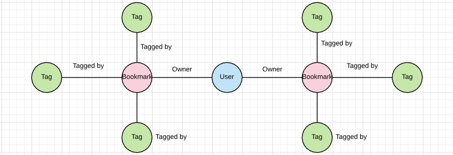

<!--Meta theme:solarized title:LnL GraphQL-->

<!--sec 1.1-->
# GraphQL and Chill

<!--sec 1.2-->
Before we get into it we need to know

<!--sec 1.3-->
## What is GraphQL?

<!--sec 1.4-->
## A Query Language for Your API*
An API design spec meant to facilitate only selecting data you need

NOTE: I put an asterisk here because the query language part is really secondary.

<!--sec 1.5-->
Primarily it organizes your data as a graph

NOTE: If you take away one thing from this lunch and learn, it should be this

<!--sec 1.6-->
The consumer shouldn't think of your API as an application they need to interface with, but as a pile of data at its disposal

NOTE: For example, Relay (GraphQL & React) wants you to treat your API as your data store

<!--sec 2.1-->
## What makes it a Query Language?

<!--sec 2.2-->
Instead of passing params to a specific endpoint to determine the shape of results, you specify the shape directly to a single endpoint

<!--sec 2.3-->
```json
query {
  users {
    posts {
      title
      content
    }
  }
}
```

NOTE: This is a general structure of a query
Query tells the API we're looking up data
A field is what tells the API what fields to get back
QUESTION: What are fields in this query?

<!--sec 3.1-->
## What makes it a Graph?

<!--sec 3.2-->
REST has nested objects
```json
users: [
  ...,
  posts: [
    ...
  ]
]
```

<!--sec 3.3-->
Where GraphQL has connections

```json
users: [
  ...,
  authoredPosts: {
    totalCount: 10,
    edges {
      authoredOn,
      node {
        title,
        content
      }
    }
  }
]
```

NOTE: think about edges as the relationship to the other object.
These edges contain metadata about the nodes
i.e. A user _authored_ a post, so the edge "authored" connects nodes "user" and "post" and would know when the event occurred

<!--sec 3.4-->
The REST version looks smaller, but the GraphQL version better illustrates relationships among data

<!--sec 3.5-->


NOTE: This is called the viewer pattern, the idea is that the user is the entry point of the graph.
Connections just follow the edges on the graph

<!--sec 4.1-->
## Why REST?

NOTE: REST promised we'd never need to think about how to access our data if we used the right HTTP verb and routes
Everything would make sense
but what's the biggest problem with REST endpoints?

<!--sec 4.2-->
## Our endpoints send back too much data!

NOTE: Enter query params...

<!--sec 4.3-->
### This is fine
`GET /api/users/posts?include_author=false&include_comments=true`

NOTE: but might not be good enough

<!--sec 4.4-->
### This is not fine
`GET /api/users/comments?since=1234567890&include[]=title&include[]=favorite&include[]=author&include[]=comments&...`

<!--sec 5.1-->
## Why GraphQL?

NOTE: it's easiest to show with an example

<!--sec 5.2-->
### Want all of a user's posts? Fine.
```json
query {
  users {
    authoredPosts {
      title
      content
    }
  }
}
```

<!--sec 5.3-->
### Want the post's comments and author? Also fine.
```json
query {
  users {
    authoredPosts {
      title
      content
      author {
        first_name
        last_name
        email
      }
      comments {
        content
        author {
          frst_name
          last_name
          email
        }
      }
    }
  }
}
```

<!--sec 5.4-->
## It's the same endpoint 
`POST /api/graphql`

NOTE: But a consumer can ask for any data they want
You can offer anything and everything, but it won't affect the consumer unless they want it

<!--sec 5.5-->
## And the data is where it belongs, in the request body

<!--sec 6.1-->
## Coexistence

NOTE: REST and GraphQL actually work really well together
for all the talk of "REST-killer" one doesn't have to "kll" the other

<!--sec 6.2-->
### Choose what works

NOTE: In the same sense, you can have GraphQL manage the read portion of your API and rely on REST to handle create, update, delete
Or you can have GraphQL handle CRUD while you use REST for auth
It's entirely up to you how far you want to dive in
At the end of the day, choose what works for you
There's no reason you can't have both a GraphQL API and a REST API

<!--sec 7.1-->
## When to use GraphQL?

<!--sec 7.2-->
## When to use GraphQL?
- Your objects can be connected to other objects

<!--sec 7.3-->
## When to use GraphQL?
- Your objects can be connected to other objects
- Your consumers don't always want all of the connected objects

<!--sec 7.4-->
## When to use GraphQL?
- Your objects can be connected to other objects
- Your consumers don't always want all of the connected objects
- You want to make your consumers happy

<!--sec 7.5-->
For further reading on nomenclature:
https://custompro98.github.io/slides/
